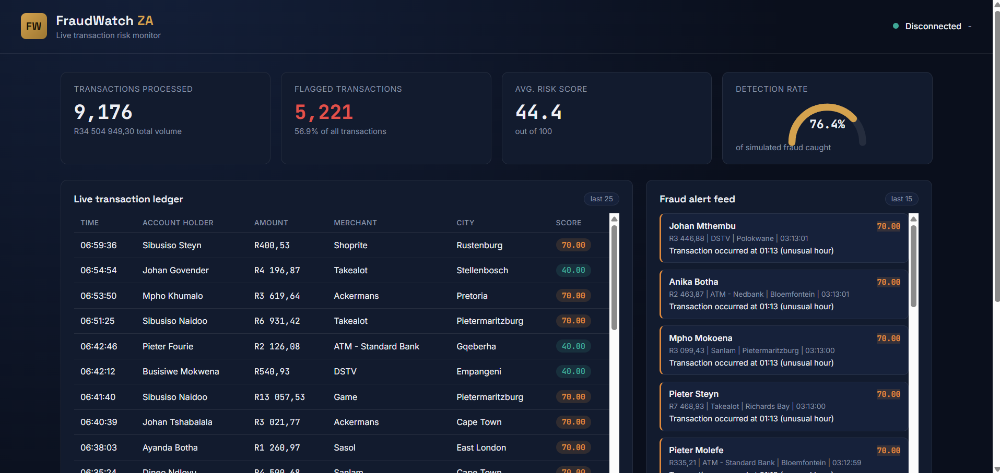
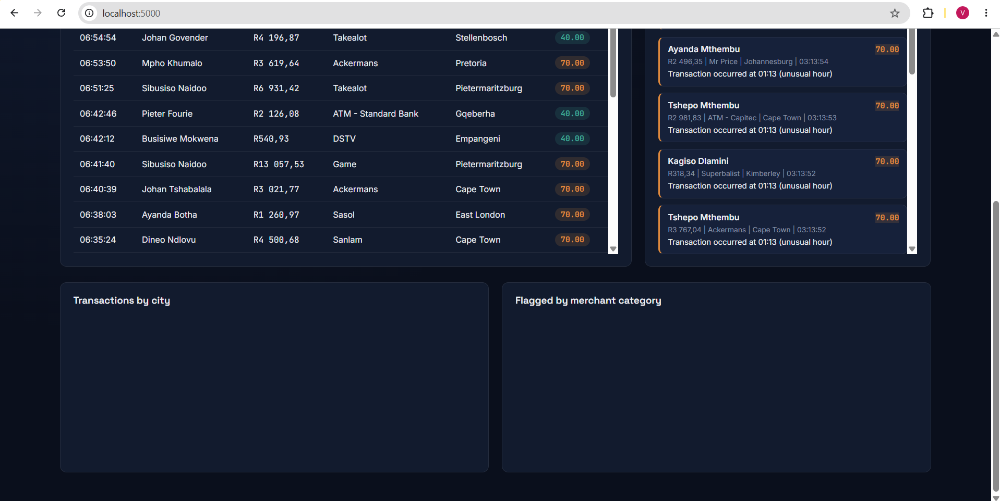
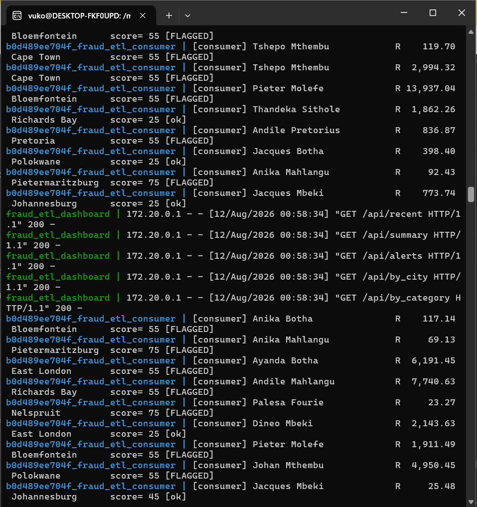

# Real-Time Fraud Detection ETL Pipeline

A real-time ETL pipeline that simulates South African financial transactions,
streams them through Kafka, scores them for fraud risk, persists everything to
PostgreSQL, and visualises the results on a live Flask dashboard.

```text
Transaction Generator -> Kafka topic -> Fraud Consumer -> PostgreSQL -> Flask Dashboard
```

## Project Layout

```text
realtime-fraud-etl/
|-- docker-compose.yml        # Postgres, Kafka, producer, consumer, dashboard
|-- Dockerfile                # Shared Python image for app services
|-- requirements.txt
|-- .env.example
|-- config.py                 # Shared config loaded by all services
|-- producer/
|   `-- transaction_generator.py
|-- consumer/
|   `-- fraud_consumer.py
|-- database/
|   |-- schema.sql             # Auto-applied on first Postgres boot
|   `-- init_db.py             # Manual schema re-apply, if needed
|-- dashboard/
|   |-- app.py
|   |-- templates/index.html
|   `-- static/{style.css, script.js}
`-- scripts/
    `-- kafka_setup.md         # Docker Kafka notes and host access tips
```

## Prerequisites

- Docker Desktop with WSL 2 integration enabled, or Docker Engine inside Ubuntu/WSL
- Git or a terminal in the project directory

You no longer need a local Python install or a manually installed local Kafka
broker to run the full pipeline.

## Start Everything

From the project root:

```bash
cp .env.example .env
docker compose up --build
```

Then open:

```text
http://localhost:5000
```

Compose starts:

- `postgres` on host port `5432`
- `kafka` on host port `29092`
- `kafka-init`, which creates the `transactions` topic
- `producer`, which generates transaction events
- `consumer`, which scores and stores transactions
- `dashboard`, which serves the live UI

## Useful Commands

Run in the foreground:

```bash
docker compose up --build
```

Run in the background:

```bash
docker compose up --build -d
```

Watch logs:

```bash
docker compose logs -f producer consumer dashboard
```

Stop services:

```bash
docker compose down
```

Reset all data, including Postgres and Kafka volumes:

```bash
docker compose down -v
docker compose up --build
```

Open pgAdmin:

```bash
docker compose --profile tools up -d pgadmin
```

Then visit:

```text
http://localhost:5050
```

Default pgAdmin login:

```text
admin@fraudetl.local
admin
```

## Configuration

The `.env` file controls local settings:

```env
POSTGRES_USER=etl_user
POSTGRES_PASSWORD=etl_password
POSTGRES_DB=fraud_etl
POSTGRES_HOST=localhost
POSTGRES_PORT=5432

KAFKA_BOOTSTRAP_SERVERS=localhost:29092
KAFKA_HOST_PORT=29092
KAFKA_TOPIC=transactions

TRANSACTIONS_PER_SECOND=2
FRAUD_INJECTION_RATE=0.05

FLASK_SECRET_KEY=change-me-in-production
DASHBOARD_PORT=5000
```

Inside Docker, Compose overrides the application containers to use:

- `POSTGRES_HOST=postgres`
- `KAFKA_BOOTSTRAP_SERVERS=kafka:9092`

The host value `localhost:29092` is only for tools you run directly from
Ubuntu/WSL outside the containers.

## How Fraud Scoring Works

Each transaction is scored from 0 to 100 in `consumer/fraud_consumer.py` using
multiple weighted rules:

| Rule | Points | Trigger |
|---|---:|---|
| Amount spike | up to 35 | Spend far above the typical range for that merchant category |
| Odd hour | 15 | Transaction between 01:00 and 04:59 |
| Velocity | 25 | Four or more transactions on the same account within 10 minutes |
| Impossible travel | 30 | Account active in a different city within 60 minutes |
| Card testing | 20 | Repeated small charges in quick succession |

A transaction is flagged at a score of `50` or higher. Flagged transactions
are stored in `fraud_alerts` as `medium` or `high` severity alerts.

The generator also marks a small percentage of transactions as simulated fraud
with `is_fraud_simulated`. The scoring logic does not use that field; it exists
so the dashboard can estimate the live detection rate.

## Development Notes

To run one service manually inside Docker:

```bash
docker compose run --rm producer
docker compose run --rm consumer
docker compose run --rm dashboard
```

To connect to Kafka from the host:

```bash
docker compose exec kafka kafka-topics.sh --bootstrap-server kafka:9092 --list
```

To apply the schema manually:

```bash
docker compose run --rm dashboard python database/init_db.py
```

## Troubleshooting

If the dashboard shows zero transactions, check that all containers are up:

```bash
docker compose ps
```

If Kafka or Postgres looks stuck, reset volumes:

```bash
docker compose down -v
docker compose up --build
```

If a port is already in use, change `POSTGRES_PORT`, `KAFKA_HOST_PORT`, or
`DASHBOARD_PORT` in `.env`.
Useful Commands
## Dashboard

The project includes a live monitoring dashboard for tracking transactions, fraud alerts, risk scores, and pipeline activity.

### FraudWatch ZA Dashboard





### Docker Environment


